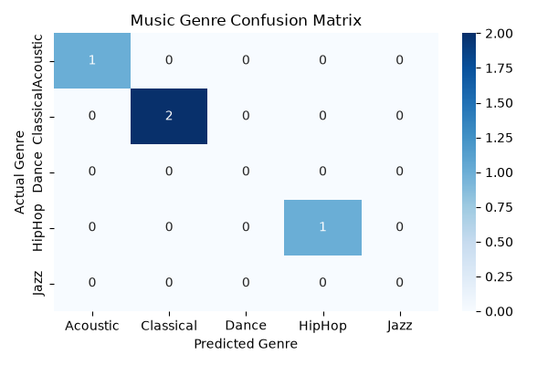
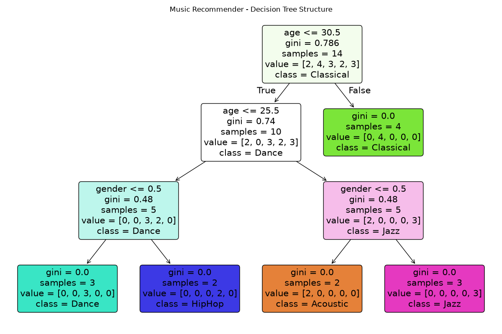

# Music Genre Recommender (Decision Tree Classifier)

An end-to-end supervised machine learning pipeline using Python, Pandas, and Scikit-Learn that predicts music preferences based on demographic attributes (age and gender).

---

## Features
- **Exploratory Modeling:** Supervised multi-class classification using `DecisionTreeClassifier`.
- **Comprehensive Evaluation:** Accuracy scoring, precision, recall, F1-score breakdown, and Confusion Matrix visualization.
- **Model Interpretability:** Visualized decision tree nodes, splitting criteria (Gini Impurity), and leaf thresholds.
- **Model Persistence:** Serialized and deserialized the trained model artifact using `joblib`.
- **Interactive CLI:** Standalone command-line inference tool for real-time predictions without opening Jupyter.

---

## Project Structure
```text
├── music.csv                 # Demographic dataset (Age, Gender, Genre)
├── music_recommender.ipynb   # Complete ML training & evaluation pipeline
├── predict_cli.py            # Standalone terminal prediction tool
├── music-recommender.joblib  # Serialized model artifact
├── confusion_matrix.png      # Performance heatmap
└── decision_tree_rules.png   # Exported decision tree structure diagram
```

---

## Model Evaluation & Visualizations

### 1. Confusion Matrix


### 2. Decision Tree Rules


---

## How to Run

### 1. Run the Training Pipeline
Launch the Jupyter Notebook:
```bash
jupyter notebook music_recommender.ipynb
```

### 2. Run the Interactive CLI
Predict genres directly from your terminal using the saved model artifact:
```bash
python predict_cli.py
```

---

## Tech Stack
- **Language:** Python
- **Data Manipulation:** Pandas
- **Machine Learning:** Scikit-Learn
- **Visualization:** Matplotlib, Seaborn
- **Persistence:** Joblib
- **Environment:** Jupyter Notebook / VS Code